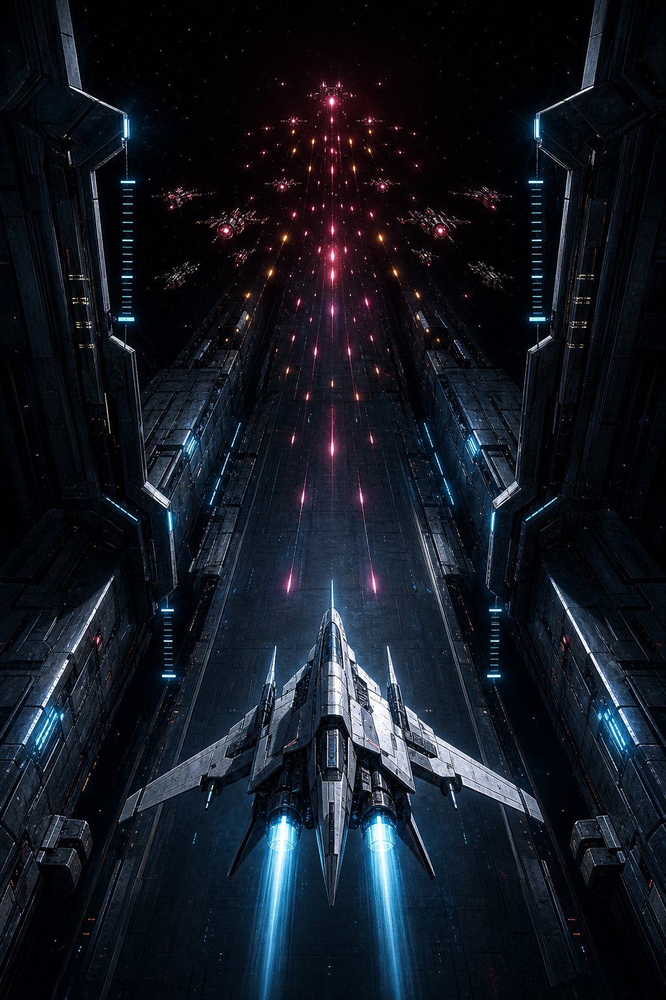

# TCFU visual identity — Corridor Signal

## Brand idea

**Corridor Signal** turns the game’s defining action into its identity: hold a narrow movement band while hostile space streams toward you. The system should feel like disciplined flight telemetry under increasing signal corruption—not generic neon sci-fi.

**Corridor** is brand language for the movement band and world stream fantasy. It is **not** a requirement for colossal trench walls or shaft architecture on the playfield. In-world presentation is **deep space**: void field, stars, sparse distant silhouettes, stream-synced parallax—not industrial corridor cages.

The name remains **TCFU**. Do not invent or publish an expansion until the game has a narrative reason for one.

### Player promise

> Hold the band. Ride the stream. Die with a high score.

### Character

- Precise, relentless, mechanical.
- Cold confidence under hot pressure.
- Arcade-direct rather than military-simulation dense.
- Hi-fi hard-surface craft, never retro pixel pastiche or purple cyberpunk wallpaper.

## Signature motif

The insignia combines three game truths:

1. **Corridor brackets** — the fixed movement band and 4:3 frame.
2. **Forward vector** — the player ship pressing into the world stream.
3. **Split signal ticks** — cyan player telemetry meeting amber hostile pressure.

Use the full lockup on title, store art, and major results moments. Use the insignia alone for the favicon, loading indicator, compact badges, and physical decals. Preserve clear space equal to one signal-tick width around it. Do not rotate, outline with rainbow gradients, or place it over detailed combat without a dark field.

## Color system

| Role | Token | Hex | Use |
|---|---|---:|---|
| Deep void | `--void-950` | `#03070B` | Primary field and letterbox |
| Instrument void | `--void-900` | `#071019` | Panels and raised surfaces |
| Hull steel | `--hull-700` | `#162D3A` | Frames, inactive rails, disabled UI |
| Player signal | `--signal-cyan` | `#5EE7FF` | Player, focus, primary action, safe telemetry |
| Vector blue | `--signal-blue` | `#2A8CFF` | Depth, secondary player energy |
| Threat amber | `--threat-amber` | `#FF9B42` | Incoming pressure, caution, enemy energy; primary in-world threat fire and hostile hull accents stay warm amber/orange/red |
| Threat magenta | `--threat-magenta` | `#FF4F87` | Critical HUD alerts and life-threatening UI only—not a mandate to retune in-world enemy fire to magenta |
| Salvage gold | `--salvage-gold` | `#F6CA62` | Scrap, rewards, bombs |
| Repair lime | `--repair-lime` | `#8DF0A2` | Repair and successful recovery only |
| Ice white | `--ice-white` | `#EAF8FF` | Primary text and hot cores |
| Muted steel | `--muted-steel` | `#819AAA` | Secondary text and inactive data |

Color is semantic. Cyan never means danger; magenta never means a beneficial pickup. Most screens should be at least 70% void and steel so signals remain meaningful.

## Typography

- **Display:** compressed, heavy, slightly forward-leaning uppercase. The current code-native stack is `Impact, Haettenschweiler, Arial Narrow Bold, sans-serif` until a licensed local display face is chosen.
- **Interface:** neutral system sans with tabular numerals. Use uppercase micro-labels with generous tracking, not paragraphs in all caps.
- **Voice:** short command fragments. Prefer “LAUNCH”, “RUN ENDED”, “WAVE 10”, “SIGNAL LOST”. Avoid jokey flavor copy and generic SaaS verbs such as “Submit”.

## Shape and layout

- Use clipped 8 px corners, rails, ticks, and open frames derived from the insignia.
- Keep the combat lane visually open. Dense chrome belongs at the outer margins.
- Forward motion is vertical in-world and slightly right-leaning in typography.
- Use one strong diagonal or bracket gesture per component; avoid nested sci-fi frames.
- Icons should survive at 16 px and rely on silhouette before glow.

## Motion

- Normal UI: 100–180 ms, direct ease-out, minimal overshoot.
- Stream motion: steady vertical translation; no decorative floating.
- Alerts: one sharp acquisition pulse, then stable. Do not continuously flash critical UI.
- The title insignia may briefly hand off from cyan to amber, suggesting the corridor is being contested.
- Respect `prefers-reduced-motion`; color and shape must carry the state without animation.

## Image direction

Before checking for provider credentials, inspect the image-generation tools and skills available in the current environment. Prefer a built-in capability when one is available; check for an API key only when the selected workflow explicitly requires it.

Use this art brief for title-screen key art:

> TCFU title-screen key art for a high-fidelity vertical arcade space shooter. A lone angular interceptor seen from elevated rear three-quarter view holds the center of deep hostile space. Cold cyan thruster plumes and precision lane-bracket telemetry face warm amber-orange hostile craft and weapons fire. Deep black void, sparse distant silhouettes, restrained emissive bloom, strong readable silhouettes, disciplined asymmetrical composition, generous negative space for a compact logo, cinematic PBR, no text, no watermark, no purple cyberpunk city, no retro pixels, no colossal trench walls as world identity.

### Key-art reference

Use this generated concept as a **partial** directional reference for:

- rear three-quarter interceptor silhouette and thruster energy
- deep void contrast and open vertical combat lane
- cold player cyan versus warm threat (amber/orange/red in-world)
- restrained emissive treatment and hard-surface craft

It is **not** a mandate to rebuild colossal corridor walls, floor shafts, or magenta fire lanes in the Run. The movement band is gameplay chrome only. Future title and store compositions should introduce the brief’s disciplined asymmetry and protect a clearer negative-space field for the lockup.

## Applications and next assets

1. Title lockup and favicon — implemented in the shell.
2. HUD icon family — HP, life, shield, bomb, W-cell, Scrap, weapon tier.
3. World decals — corridor brackets, hazard ticks, salvage chevrons.
4. Ship-kit submarks — one silhouette-led mark per Vanguard, Striker, Aegis, Phantom.
5. Key art and store capsule — generate from the image brief with the best available image-generation capability; provider credentials are a workflow-specific fallback, not a prerequisite.

Every new asset should pass three checks: recognizable in silhouette, assigned a semantic color role, and visibly related to either the corridor brackets (band/frame motif) or forward vector.

### In-game look checklist (deep-space target)

1. Run reads as deep space, not a trench corridor or desk grid.
2. No colossal wall shaft architecture as world identity.
3. Threat fire and hostile accents stay warm (amber/orange/red runtime tokens).
4. Player thrusters and shots read cyan/cool with visible plume energy on Medium+ (all kits).
5. Scenery stays subordinate to combat silhouettes; band chrome is not physical walls.
6. Low quality reduces density (stars, streaks, plumes) without flipping team colors.
7. Hangar kit preview matches Run thruster language.
8. Presentation juice (hit/kill/bomb/pickup/death) still fires.
